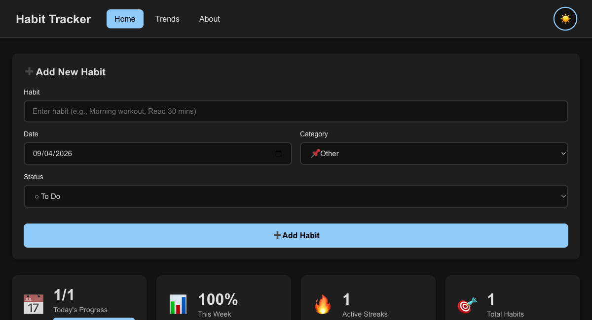

# Habit Tracker - Development Journey

A modern, feature-rich habit tracking application built with React that helps users build better habits through consistent tracking and insightful analytics.



## 📋 Table of Contents

- [Overview](#overview)
- [Features](#features)
- [Development Journey](#development-journey)
- [Tech Stack](#tech-stack)
- [Getting Started](#getting-started)
- [Deployment](#deployment)
- [Testing](#testing)
- [Project Structure](#project-structure)
- [Future Enhancements](#future-enhancements)

## 🎯 Overview

Habit Tracker is a browser-based application that enables users to track daily habits, monitor progress, and gain insights through comprehensive analytics. All data is stored locally in the browser using localStorage, ensuring privacy and instant access without requiring backend infrastructure.

**Live Demo:** [Deployed on Vercel](https://your-app-url.vercel.app) *(configure your deployment URL)*

## ✨ Features

### Core Functionality
- ✅ **Habit Management**: Add, edit, and delete habits with ease
- 📅 **Date Tracking**: Track habits across any date (past, present, or future)
- 🏷️ **8 Category System**: Organize habits into predefined categories
  - Health & Fitness 💪
  - Work & Productivity 💼
  - Learning & Growth 📚
  - Personal Care 🧘
  - Social & Family 👥
  - Finance & Money 💰
  - Hobbies & Fun 🎨
  - Other 📌

### Status Tracking
- ✓ Completed
- ○ To Do
- ✗ Not Completed
- ⊘ Skipped

### Smart Organization
- 📊 **Summary Cards**: Real-time progress metrics on home page
  - Today's Progress (with visual progress bar)
  - This Week's Completion Rate
  - Active Streaks Counter
  - Total Habits Tracked
- 🔍 **Category Filtering**: Filter habits by category for focused viewing
- 📆 **Automatic Date Grouping**: Habits grouped by "Today", "Yesterday", or specific dates

### Analytics & Insights
- 📈 **Comprehensive Trends Page**: Deep analytics for habit performance
  - Overall statistics (unique habits, days tracked, completion rate)
  - Per-habit metrics (days tracked, completion rate, streaks)
  - Current and longest streaks calculation
  - Trend analysis (improving/stable/declining based on 7-day comparisons)
  - Top Performers: Best 3 habits by completion rate
  - Needs Attention: Habits with <50% completion requiring focus

### User Experience
- 🌓 **Theme Toggle**: Light and dark mode with persistence
- 💾 **Auto-Save**: All changes automatically persist to localStorage
- 📱 **Responsive Design**: Mobile-first design with breakpoints for tablet (768px) and mobile (480px)
- ⚡ **Client-Side Routing**: Fast navigation with React Router

## 🚀 Development Journey

This section chronicles the step-by-step development process from initial setup to deployment and testing.

### Phase 1: Project Initialization (April 8, 2026)

**Commit:** `1139688 - Add habit tracker application with analytics`

#### Step 1: Create React App Setup
```bash
# Created project using Create React App
npx create-react-app habit-tracker
cd habit-tracker
```

**What was set up:**
- React 19.2.4 with modern hooks
- Jest and React Testing Library for testing
- Webpack build configuration via react-scripts
- Development server with hot module replacement

#### Step 2: Install Core Dependencies
```bash
# Added routing library
npm install react-router-dom@^7.14.0
```

#### Step 3: Initial Architecture Design

**Project Structure Created:**
```
src/
├── components/          # Reusable UI components
│   ├── HabitForm.js    # Form for adding habits
│   ├── HabitList.js    # Display habits in cards
│   ├── Navigation.js   # Header navigation
│   ├── ThemeToggle.js  # Light/dark mode toggle
│   ├── TextInput.js    # Reusable text input
│   ├── DateSelector.js # Date picker component
│   └── StatusSelector.js # Status dropdown
├── hooks/
│   └── useTheme.js     # Custom hook for theme management
├── pages/
│   ├── Home.js         # Main tracker interface
│   ├── Trends.js       # Analytics dashboard
│   └── About.js        # Information page
├── styles/
│   ├── habit.css       # Component-specific styles
│   └── trends.css      # Trends page styles
├── utils/
│   └── habitAnalytics.js # Analytics calculations
├── App.js              # Root component with routing
├── App.css             # Global layout styles
└── index.css           # CSS variables and theme definitions
```

#### Step 4: Implemented Core Features

**State Management:**
- Set up React useState hooks in App.js for habit management
- Implemented localStorage integration for data persistence
- Created automatic save mechanism with useEffect

**Routing Configuration:**
```javascript
// App.js - React Router setup
<Router>
  <Routes>
    <Route path="/" element={<Home />} />
    <Route path="/trends" element={<Trends />} />
    <Route path="/about" element={<About />} />
  </Routes>
</Router>
```

**Theme System:**
- Created useTheme custom hook with localStorage persistence
- Implemented CSS custom properties for theming
- Set up data-theme attribute switching on :root element
- Defined two themes: light (default) and dark

**Data Model:**
```javascript
{
  habit: "Morning workout",      // String
  date: "2026-04-08",            // ISO date (YYYY-MM-DD)
  status: "Completed"            // One of 4 status types
}
```

**Key Components Developed:**

1. **HabitForm**: Complete form handling with validation
2. **HabitList**: Card-based display with date grouping logic
3. **Navigation**: NavLink integration with active states
4. **ThemeToggle**: Sun/moon emoji toggle button
5. **Trends**: Analytics page with statistics and insights

**Analytics Implementation:**
- Created `habitAnalytics.js` utility for data processing
- Implemented streak calculation using consecutive date matching
- Built trend comparison (last 7 days vs previous 7 days)
- Developed habit grouping by name (case-insensitive)
- Calculated completion rates and top performers

### Phase 2: Repository Restructuring (April 8, 2026)

**Commit:** `1591dd7 - Restructure repository for easier deployment`

#### Changes Made:
- Moved all files from `habit-tracker/` subdirectory to repository root
- Updated file references and import paths
- Simplified deployment configuration
- Prepared structure for Vercel integration

**Why this was necessary:**
- Deployment platforms like Vercel expect the project at repository root
- Simplified directory structure improves maintainability
- Easier CI/CD integration

### Phase 3: Deployment Configuration (April 8, 2026)

**Commit:** `0113643 - Add Vercel configuration for deployment`

#### Step 1: Created Vercel Configuration

**File:** `vercel.json`
```json
{
  "rewrites": [
    {
      "source": "/(.*)",
      "destination": "/index.html"
    }
  ]
}
```

**Purpose:**
- Enables client-side routing in production
- All routes redirect to index.html for React Router to handle
- Prevents 404 errors on direct URL access or page refresh

#### Step 2: Deployment Process

```bash
# Install Vercel CLI (if not already installed)
npm install -g vercel

# Deploy to Vercel
vercel

# Follow prompts to:
# 1. Link to Vercel account
# 2. Configure project settings
# 3. Deploy to production
```

**Build Configuration on Vercel:**
- Build Command: `npm run build`
- Output Directory: `build`
- Install Command: `npm install`
- Node Version: 18.x (auto-detected)

**Deployment Features:**
- Automatic deployments on git push
- Preview deployments for pull requests
- HTTPS enabled by default
- Global CDN distribution
- Custom domain support

### Phase 4: Feature Enhancement (April 8, 2026)

**Commit:** `6944904 - Add categories, summary cards and progress bar`

This was the most significant feature update, adding substantial UX improvements.

#### Step 1: Category System Implementation

**Created:** `src/constants/categories.js`
```javascript
export const CATEGORIES = [
  { id: "health", name: "Health & Fitness", emoji: "💪" },
  { id: "work", name: "Work & Productivity", emoji: "💼" },
  { id: "learning", name: "Learning & Growth", emoji: "📚" },
  { id: "personal", name: "Personal Care", emoji: "🧘" },
  { id: "social", name: "Social & Family", emoji: "👥" },
  { id: "finance", name: "Finance & Money", emoji: "💰" },
  { id: "hobbies", name: "Hobbies & Fun", emoji: "🎨" },
  { id: "other", name: "Other", emoji: "📌" }
];
```

**Created:** `src/components/CategorySelector.js`
- Dropdown component with emoji-prefixed options
- Default selection: "Other"
- Integrated into HabitForm

#### Step 2: Summary Cards System

**Created:** `src/components/SummaryCards.js`
- Container component for all summary statistics
- Displays 4 key metrics with icons

**Created:** `src/components/StatCard.js`
- Reusable card component for individual stats
- Props: icon, value, label, children (for progress bar)

**Created:** `src/utils/homeSummaryAnalytics.js`
- Utility functions for calculating summary metrics
- Functions:
  - `getTodayProgress()`: Today's completion ratio
  - `getWeekProgress()`: Current week completion percentage
  - `getActiveStreaks()`: Count of habits with active streaks
  - `getTotalUniqueHabits()`: Count of unique habit names

**Summary Cards Display:**
1. 📅 **Today's Progress**: "X/Y" format with progress bar
2. 📊 **This Week**: Percentage completion
3. 🔥 **Active Streaks**: Count of ongoing streaks
4. 🎯 **Total Habits**: Unique habit count

#### Step 3: Progress Bar Component

**Created:** `src/components/ProgressBar.js`
- Visual progress indicator
- Props: percentage (0-100)
- Smooth gradient fill animation
- Responsive width

**Created:** `src/styles/progress-bar.css`
- Styled container with border and background
- Filled portion with gradient color
- Smooth transitions

**Created:** `src/styles/summary.css`
- Grid layout for summary cards
- Responsive design for different screen sizes
- Hover effects and styling

#### Step 4: Category Filtering

**Updated:** `src/pages/Home.js`
- Added category filter state management
- Filter button row with all categories + "All" option
- Active filter highlighting
- Filter habits display based on selected category

**Updated:** `src/components/HabitList.js`
- Accepts filtered habits as prop
- Displays appropriate counts per date group
- Shows empty state when no habits match filter

#### Step 5: Enhanced Habit Form

**Updated:** `src/components/HabitForm.js`
- Integrated CategorySelector component
- Added unique ID generation for habits (using timestamp)
- Improved form reset logic after submission
- Enhanced edit mode with category preservation

#### Step 6: Visual Enhancements

**Updated Styles:**
- `src/styles/habit.css`: Added category badge styling, filter buttons, grid improvements
- Enhanced card hover effects with transform and shadows
- Improved responsive breakpoints
- Better color-coding for status badges

**Files Modified Statistics:**
- 47 files changed
- 1,445 additions
- 108 deletions

### Phase 5: UI Testing with Playwright MCP (April 9, 2026)

#### Step 1: Playwright MCP Integration

Integrated Model Context Protocol (MCP) server for Playwright browser automation directly into the development workflow.

**What is Playwright MCP?**
- Browser automation tool accessible via MCP protocol
- Enables automated UI testing through natural language
- Provides snapshot-based interaction with web pages
- Captures console logs, network requests, and screenshots

**Setup Process:**
1. Configured Claude Code to use Playwright MCP server
2. Started development server on `http://localhost:3001`
3. Connected Playwright browser automation tools

#### Step 2: Comprehensive Test Coverage Analysis

**Generated:** `UI_TEST_REPORT.md`
- Comprehensive 170+ test case documentation
- 14 major functional areas identified
- Priority-based test organization (High/Medium/Low)
- Detailed test scenarios with expected results

**Test Coverage Areas:**
1. Navigation (7 tests)
2. Theme Toggle (7 tests)
3. Add Habit Form (20 tests)
4. Habit List Display (18 tests)
5. Summary Cards (12 tests)
6. Category Filter (10 tests)
7. Edit Habit (11 tests)
8. Delete Habit (6 tests)
9. LocalStorage Persistence (8 tests)
10. Trends Page (14 tests)
11. About Page (3 tests)
12. Responsive Design (7 tests)
13. Accessibility (7 tests)
14. Integration/E2E (6 tests)

**Test Priority Distribution:**
- High Priority: 77 tests (45%) - Core functionality
- Medium Priority: 60 tests (35%) - Enhanced features
- Low Priority: 33 tests (20%) - Polish features

#### Step 3: Testing Artifacts Generated

**Created Directory:** `.playwright-mcp/`
- Page snapshots in YAML format
- Console log captures
- Test execution artifacts
- Screenshots and network request logs

**Key Files:**
- Console logs: Captured JavaScript errors and warnings
- Page snapshots: Accessibility tree snapshots for testing
- Network monitoring: API call tracking and performance

#### Step 4: Testing Strategy Documentation

**Recommended Testing Phases:**

1. **Unit Testing** (Jest + React Testing Library)
   - Component-level tests
   - 80%+ code coverage goal
   - Focus on form validation, rendering, user interactions

2. **Integration Testing**
   - Multi-component workflows
   - localStorage integration
   - State management verification

3. **E2E Testing** (Playwright)
   - Full user journeys
   - Cross-page navigation
   - Data persistence validation
   - Theme consistency

4. **Accessibility Testing**
   - WCAG AA compliance
   - Keyboard navigation
   - Screen reader compatibility
   - Color contrast verification

5. **Visual Regression Testing** (Optional)
   - Screenshot comparison
   - Theme consistency
   - Responsive layout verification

**Testing Tools Recommended:**
```json
{
  "@testing-library/react": "^16.3.2",
  "@testing-library/jest-dom": "^6.9.1",
  "@testing-library/user-event": "^13.5.0",
  "@playwright/test": "^1.40.0",
  "jest-axe": "^8.0.0",
  "jest-localstorage-mock": "^2.4.26"
}
```

## 🛠️ Tech Stack

### Frontend
- **React** (19.2.4): UI library with modern hooks
- **React Router DOM** (7.14.0): Client-side routing
- **Create React App** (5.0.1): Build tooling and configuration

### Styling
- **CSS3**: Custom properties for theming
- **CSS Modules**: Scoped component styling
- **Responsive Design**: Mobile-first approach with media queries

### State Management
- **React Hooks**: useState, useEffect
- **Custom Hooks**: useTheme for theme management
- **localStorage API**: Client-side data persistence

### Testing (Configured)
- **Jest**: Unit test runner
- **React Testing Library**: Component testing utilities
- **Playwright MCP**: E2E browser automation
- **Testing Library DOM**: DOM query utilities

### Development Tools
- **Node.js** (18.x): Runtime environment
- **npm**: Package management
- **ESLint**: Code quality
- **Vercel**: Deployment platform

### Browser Support
- Chrome (latest)
- Firefox (latest)
- Safari (latest)
- Edge (latest)
- Mobile browsers (iOS Safari, Chrome Mobile)

## 📦 Getting Started

### Prerequisites
```bash
node >= 18.0.0
npm >= 8.0.0
```

### Installation

1. **Clone the repository**
```bash
git clone <your-repo-url>
cd habitTracker
```

2. **Install dependencies**
```bash
npm install
```

3. **Start development server**
```bash
npm start
```

Application will open at `http://localhost:3000`

### Available Scripts

#### `npm start`
Runs the app in development mode with hot reloading.
- Opens browser at http://localhost:3000
- Automatically reloads on file changes
- Shows lint errors in console

#### `npm test`
Launches test runner in interactive watch mode.
- Runs all test files matching `*.test.js` or `*.spec.js`
- Provides coverage reports with `--coverage` flag
- Re-runs tests on file changes

#### `npm run build`
Creates optimized production build in `build/` folder.
- Minifies JavaScript and CSS
- Adds content hashes to filenames for cache busting
- Optimizes images and assets
- Ready for deployment

#### `npm run eject`
**One-way operation - use with caution!**
Ejects from Create React App to customize webpack, Babel, ESLint configuration.

## 🚀 Deployment

### Deploying to Vercel (Recommended)

#### Method 1: Vercel CLI
```bash
# Install Vercel CLI globally
npm install -g vercel

# Deploy
vercel

# Deploy to production
vercel --prod
```

#### Method 2: GitHub Integration
1. Push code to GitHub repository
2. Visit [vercel.com](https://vercel.com)
3. Click "New Project"
4. Import your GitHub repository
5. Configure build settings:
   - Build Command: `npm run build`
   - Output Directory: `build`
   - Install Command: `npm install`
6. Click "Deploy"

**Automatic Deployments:**
- Every push to `main` triggers production deployment
- Pull requests get preview deployments
- Automatic HTTPS and CDN distribution

### Deploying to Other Platforms

#### Netlify
```bash
# Build the app
npm run build

# Deploy using Netlify CLI
netlify deploy --prod --dir=build
```

**Configuration:** Create `netlify.toml`
```toml
[build]
  command = "npm run build"
  publish = "build"

[[redirects]]
  from = "/*"
  to = "/index.html"
  status = 200
```

#### GitHub Pages
```bash
# Install gh-pages
npm install --save-dev gh-pages

# Add to package.json
{
  "homepage": "https://yourusername.github.io/habitTracker",
  "scripts": {
    "predeploy": "npm run build",
    "deploy": "gh-pages -d build"
  }
}

# Deploy
npm run deploy
```

### Environment Variables

If you need environment-specific configuration, create `.env` files:

```bash
# .env.local (not committed to git)
REACT_APP_API_URL=https://api.example.com
REACT_APP_ENV=production
```

Access in code: `process.env.REACT_APP_API_URL`

## 🧪 Testing

### Current Testing Setup

The application is configured with Jest and React Testing Library via `react-scripts`.

**Test Configuration:** `src/setupTests.js`
```javascript
import '@testing-library/jest-dom';
```

### Running Tests

```bash
# Run all tests
npm test

# Run tests with coverage
npm test -- --coverage

# Run tests in CI mode (non-interactive)
CI=true npm test

# Run specific test file
npm test HabitForm.test.js
```

### Test Coverage Report

A comprehensive UI test coverage report has been generated documenting 170+ test cases.

**View Full Report:** [UI_TEST_REPORT.md](UI_TEST_REPORT.md)

**High Priority Test Areas:**
- Form validation and submission
- Habit CRUD operations
- localStorage persistence
- Navigation and routing
- Category filtering
- Summary cards accuracy
- Accessibility compliance

### Writing Tests

**Example Component Test:**
```javascript
// src/components/HabitForm.test.js
import { render, screen, fireEvent } from '@testing-library/react';
import HabitForm from './HabitForm';

test('submits form with valid habit data', () => {
  const mockAddHabit = jest.fn();
  render(<HabitForm onAddHabit={mockAddHabit} />);

  fireEvent.change(screen.getByPlaceholderText(/enter habit/i), {
    target: { value: 'Morning workout' }
  });

  fireEvent.click(screen.getByRole('button', { name: /add habit/i }));

  expect(mockAddHabit).toHaveBeenCalledWith(
    expect.objectContaining({ habit: 'Morning workout' })
  );
});
```

### E2E Testing with Playwright

See [UI_TEST_REPORT.md](UI_TEST_REPORT.md) for detailed E2E test scenarios.

## 📁 Project Structure

```
habitTracker/
├── public/                      # Static assets
│   ├── index.html              # HTML template
│   ├── favicon.ico             # App icon
│   └── manifest.json           # PWA manifest
│
├── src/
│   ├── components/             # Reusable React components
│   │   ├── CategorySelector.js # Category dropdown
│   │   ├── DateSelector.js     # Date picker
│   │   ├── HabitForm.js        # Add/Edit habit form
│   │   ├── HabitList.js        # Habit cards display
│   │   ├── Navigation.js       # Header navigation
│   │   ├── ProgressBar.js      # Progress visualization
│   │   ├── StatCard.js         # Summary metric card
│   │   ├── StatusSelector.js   # Status dropdown
│   │   ├── SummaryCards.js     # Summary section container
│   │   ├── TextInput.js        # Text input field
│   │   └── ThemeToggle.js      # Dark/light mode toggle
│   │
│   ├── constants/              # App constants
│   │   └── categories.js       # Category definitions
│   │
│   ├── hooks/                  # Custom React hooks
│   │   └── useTheme.js         # Theme management hook
│   │
│   ├── pages/                  # Route components
│   │   ├── About.js            # About page
│   │   ├── Home.js             # Main tracker page
│   │   └── Trends.js           # Analytics dashboard
│   │
│   ├── styles/                 # CSS files
│   │   ├── habit.css           # Habit components styles
│   │   ├── progress-bar.css    # Progress bar styles
│   │   ├── summary.css         # Summary cards styles
│   │   └── trends.css          # Trends page styles
│   │
│   ├── utils/                  # Utility functions
│   │   ├── habitAnalytics.js   # Trends calculations
│   │   └── homeSummaryAnalytics.js # Summary metrics
│   │
│   ├── App.js                  # Root component
│   ├── App.css                 # Global app styles
│   ├── App.test.js             # App tests
│   ├── index.js                # App entry point
│   ├── index.css               # CSS variables & themes
│   └── setupTests.js           # Test configuration
│
├── .gitignore                  # Git ignore rules
├── CLAUDE.md                   # Project documentation for Claude Code
├── package.json                # Dependencies and scripts
├── package-lock.json           # Locked dependency versions
├── README.md                   # This file
├── UI_TEST_REPORT.md           # Comprehensive test documentation
├── vercel.json                 # Vercel deployment config
└── dark-theme.png              # Screenshot for README
```

## 🎨 Features Deep Dive

### Theme System

**Implementation:**
- CSS custom properties in `index.css`
- Theme state managed by `useTheme` hook
- Persists to localStorage under key: `habit-tracker-theme`
- Applied via `data-theme` attribute on document root

**Theme Variables:**
```css
:root[data-theme="light"] {
  --bg-primary: #ffffff;
  --text-primary: #333333;
  /* ... more variables */
}

:root[data-theme="dark"] {
  --bg-primary: #1a1a1a;
  --text-primary: #e0e0e0;
  /* ... more variables */
}
```

### Data Persistence

**Storage Keys:**
- `habit-tracker-habits`: Array of habit objects
- `habit-tracker-theme`: Current theme ("light" or "dark")

**Habit Object Structure:**
```javascript
{
  id: "1712345678901",           // Timestamp-based unique ID
  habit: "Morning workout",       // Habit name
  date: "2026-04-08",            // ISO date string
  category: "Health & Fitness",   // Category name
  status: "Completed"            // One of 4 statuses
}
```

**Auto-Save Mechanism:**
```javascript
// App.js
useEffect(() => {
  localStorage.setItem(HABITS_STORAGE_KEY, JSON.stringify(habits));
}, [habits]);
```

### Analytics Calculations

**Streak Algorithm:**
1. Group habits by name (case-insensitive)
2. Sort dates in descending order
3. Starting from today, count consecutive days with "Completed" status
4. Break on first gap or non-completed status

**Trend Analysis:**
1. Split habit entries into two 7-day windows
2. Calculate completion rate for each window
3. Compare: improving (>10% increase), declining (>10% decrease), or stable

**Completion Rate:**
```javascript
completionRate = (completedCount / totalCount) * 100
```

### Responsive Design Breakpoints

```css
/* Mobile phones */
@media (max-width: 480px) {
  /* Single column layout */
}

/* Tablets */
@media (max-width: 768px) {
  /* 2-column grid, stacked forms */
}

/* Desktop */
@media (min-width: 769px) {
  /* Multi-column grid, max-width 1200px */
}
```

## 🔮 Future Enhancements

### Planned Features
- [ ] Export/Import data (JSON, CSV)
- [ ] Habit reminders and notifications
- [ ] Custom categories
- [ ] Habit templates for quick setup
- [ ] Multi-device sync (requires backend)
- [ ] Habit notes/journaling
- [ ] Weekly/monthly reports
- [ ] Goal setting with milestones
- [ ] Gamification (badges, achievements)
- [ ] Social sharing of progress
- [ ] Dark mode auto-switching based on system preference
- [ ] PWA support for offline functionality
- [ ] Backup to cloud storage

### Technical Improvements
- [ ] Implement comprehensive test suite (170+ tests documented)
- [ ] Add error boundaries for better error handling
- [ ] Implement lazy loading for routes
- [ ] Add TypeScript for type safety
- [ ] Optimize bundle size with code splitting
- [ ] Add service worker for offline support
- [ ] Implement virtual scrolling for large habit lists
- [ ] Add internationalization (i18n)
- [ ] Performance monitoring and analytics
- [ ] Accessibility improvements (WCAG AAA compliance)

## 📝 Documentation

- **Project Instructions:** [CLAUDE.md](CLAUDE.md) - Guidance for Claude Code development
- **Test Coverage:** [UI_TEST_REPORT.md](UI_TEST_REPORT.md) - Comprehensive test documentation
- **Component Library:** Custom UI components in `src/components/`
- **Analytics Utils:** Documented functions in `src/utils/`

## 🤝 Contributing

This is a personal project, but suggestions and feedback are welcome!

### How to Contribute
1. Fork the repository
2. Create a feature branch (`git checkout -b feature/amazing-feature`)
3. Commit your changes (`git commit -m 'Add amazing feature'`)
4. Push to the branch (`git push origin feature/amazing-feature`)
5. Open a Pull Request

### Development Guidelines
- Follow existing code style and component patterns
- Write tests for new features (refer to UI_TEST_REPORT.md)
- Update documentation for significant changes
- Ensure responsive design works on all breakpoints
- Test in both light and dark themes

## 📄 License

This project is open source and available for personal and educational use.

## 🙏 Acknowledgments

- Built with [Create React App](https://create-react-app.dev/)
- Deployed on [Vercel](https://vercel.com)
- Tested with [Playwright MCP](https://playwright.dev)
- Icons and emojis from Unicode standard
- Developed with assistance from [Claude Code](https://claude.ai/code)

## 📧 Contact

For questions, suggestions, or feedback, please open an issue on the repository.

---

**Happy Habit Tracking!** 🎯

*Last Updated: April 12, 2026*
